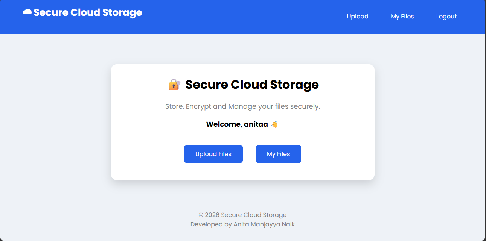
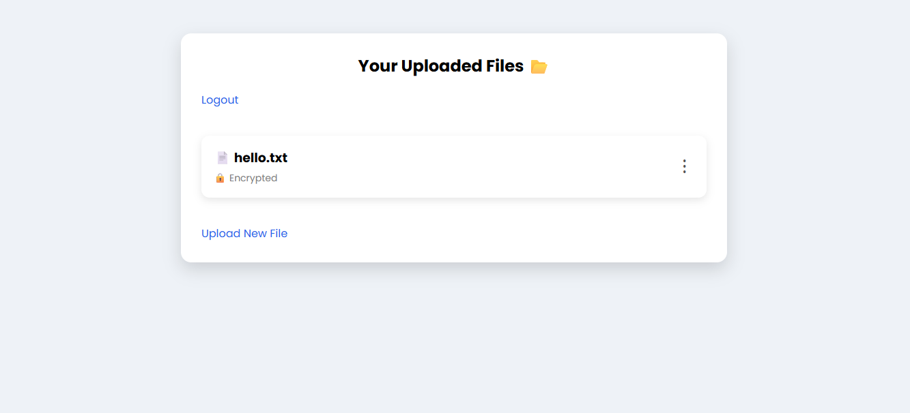

# 🔐 Secure Cloud Storage System

## Project Overview

Secure Cloud Storage System is a web application developed using **Python Flask and SQLite** that allows users to securely upload, store, download, and manage their files.

The system provides **user authentication, password hashing, encrypted file storage, user-specific file access, and file integrity verification**.

## Features

* 👤 User Registration (Signup)
* 🔑 Secure Login and Logout
* 🔐 Password Hashing using Werkzeug
* 🧂 Salted Password Hashing
* 📁 Secure File Upload
* 🔒 File Encryption using Fernet
* 👥 User-Specific File Access
* ⬇️ File Download
* 🛡️ File Integrity Verification using SHA-256
* 🗑️ File Delete
* 🔐 Session-Based Access Control
* 📱 Simple and User-Friendly Interface

## Security Features

### 1. Password Hashing

User passwords are not stored as plain text.

The application uses **Werkzeug password hashing**, which automatically uses a random salt as part of the password-hashing process.

```text
Password
    ↓
Werkzeug Password Hashing + Salt
    ↓
Password Hash
    ↓
SQLite Database
```

### 2. File Encryption

Uploaded files are encrypted using **Fernet symmetric encryption** before being stored.

```text
Original File
     ↓
Fernet Encryption
     ↓
Encrypted File
     ↓
Storage
```

The original file is decrypted when an authorized user downloads it.

### 3. File Integrity Verification

The application uses **SHA-256** to generate a fingerprint of the original file.

The hash is stored in the SQLite database and can later be used to verify whether the file contents have changed.

```text
File
 ↓
SHA-256
 ↓
File Hash
 ↓
SQLite Database
```

During integrity verification, the file is hashed again and compared with the stored hash.

## Technologies Used

* **Python**
* **Flask**
* **SQLite**
* **HTML**
* **CSS**
* **Werkzeug**
* **Cryptography (Fernet)**
* **SHA-256**
* **Render**

## Project Structure

```text
Secure-Cloud-Storage/
│
├── app.py
├── requirements.txt
├── README.md
├── Procfile
│
├── templates/
│   ├── home.html
│   ├── signup.html
│   ├── login.html
│   ├── update.html
│   └── files.html
│
├── static/
│   └── style.css
│
└── screenshots/
    ├── Home.png
    ├── Signup.png
    |── Login.png
    ├── Options.png
    ├── Upload.png
    ├── Files.png
    └── File_Options.png
```

## Database

The application uses **SQLite** to store user and file-related information.

Conceptually, the database contains:

```text
Users
--------------------------------
id | username | password_hash
```

and file information such as:

```text
Files
-----------------------------------------------
id | username | filename | file_hash
```

The actual uploaded file contents are stored separately from the database in encrypted form.

## Installation

### 1. Clone the Repository

```bash
git clone <your-github-repository-url>
```

### 2. Open the Project Folder

```bash
cd Secure-Cloud-Storage
```

### 3. Install Required Packages

```bash
pip install -r requirements.txt
```

### 4. Run the Application

```bash
python app.py
```

### 5. Open the Application

Open your browser and visit:

```text
http://127.0.0.1:5000
```

## Application Workflow

```text
Home Page
    ↓
Signup / Login
    ↓
Upload File
    ↓
Fernet Encryption
    ↓
My Files
    ↓
Download / Verify Integrity / Delete
    ↓
Logout
```

## Screenshots

### Home Page


### Signup Page


### Login Page


### Options Page



### Upload Page


### My Files Page


### File Options



## Live Demo

🔗 https://secure-cloud-storage-x3fv.onrender.com

## Deployment

The application is deployed using **Render** so that the project can be accessed through a web browser for demonstration and testing.

## Future Enhancements

* ☁️ Persistent cloud database and storage
* 🔑 Secure external key management
* 👥 Secure file sharing between users
* 🔐 Zero-Knowledge Encryption
* 📧 Email-based account recovery
* 📊 Improved security monitoring and logging

## Author

**Anita Manjayya Naik**

BCA (2024–2027)

Yenepoya Arts Science Commerce and Management
